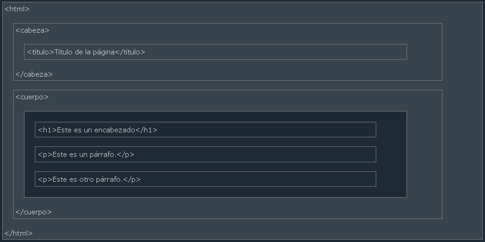
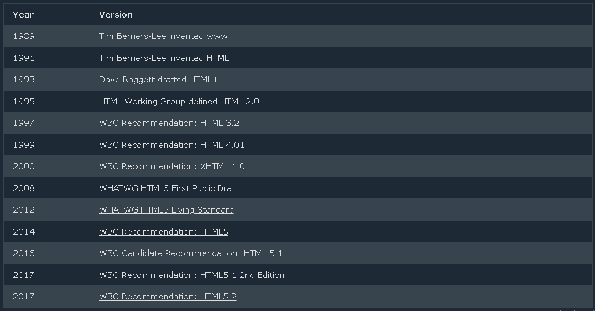

# Estructura de la página HTML
A continuación se muestra una visualización de la estructura de una página __HTML__.

_Nota:_ El contenido dentro de la sección `<cuerp>` se mostrará en un navegador. El contenido dentro del elemento `<title>` se mostrará en la barra de título del navegador o en la pestaña de la página.

***
## Historia de HTML
Desde los  primeros dias de la __World__ __Wide__ __Web__, ha habido muchas versiones de __HTML__:

_Nota:_ Estaremos usando la ultima versión 