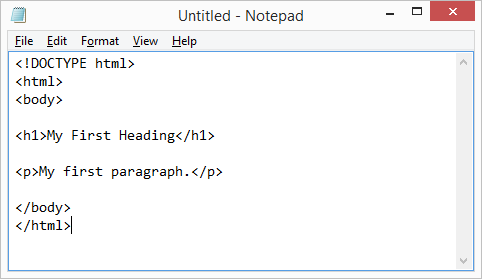
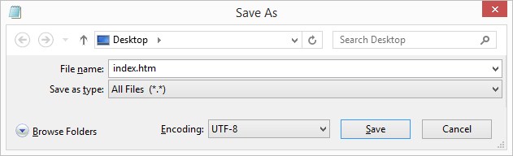
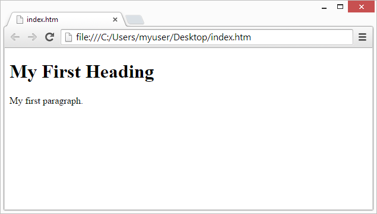

# Editores HTML
Un editor de texto simple es todo lo que se necesita para aprender a programar en __HTML__.

## Aprende HTML usando el Bloc de notas o TextEdit 
-   Las págians web se pueden crear y modificar utilizando editores __HTML__  profecionales.
-   Sin embargo, para emprender __HTML__ recomendamos un editor de texto simple como lo puede ser Notepad(PC) o TextEdit(MAC) en nuestro caso estaremos usando VS Code(PC).
-   Creemos que utilizar un editor de texto secillo es una buena forma de aprender __HTML__.
-   Siga los siguientes pasos a continuación para crear su primera página web con Notepad o TextEdit.

***
### Paso 1: abra el Bloc de notas (pc)
-   Windows 8 o posteriror: abra la pantalla de inicio (el simbolo de la ventana en la parte inferior izquierda de su pantalla). Escribe __Bloc de notas__ 
-   Windows 7 o anterior: abra __Inicio__ `>` programas `>` Accesorios `>` Bloc de notas 

***
### Paso 2: escribe algo de HTML
Escriba o copie el siguiente fragmento de código __HTML__ en el Bloc de notas:

~~~
<!DOCTYPE html>
<html lang="es">
    <head>
        <meta charset="UTF-8">
        <meta name="viewport" content="width=device-width, initial-scale=1.0">
        
        <title>Editores HTML5</title>
    </head>

    <body>
        <h1>My first heading</h1>
        
        
My first paragraph.

    </body>
</html>
~~~

***
### Paso 3: guarde la página  HTML 
Guarde el archivo en su cumputadora. seleccione `>` __guardar como__ en el menú del Bloc de notas. 

Nombra el archivo "Index.html" y establesca la codificación en __UTF-8__ (que es la codificación preferida para los archivos HTML).

_Consejo:_ Puede utilizar ".Htm" o ".HTML" como la extención del archivo. No hay diferencia; es tu decision.

***
### Paso 4: vea la págian HTML en su navegador 
Abra el archivo __HTML__ guardado en su navegador favorito (haga doble clic en el archivo o haga clic derecho y seleccione "Abrir con").

El resultado se parecerá mucho a esto:

