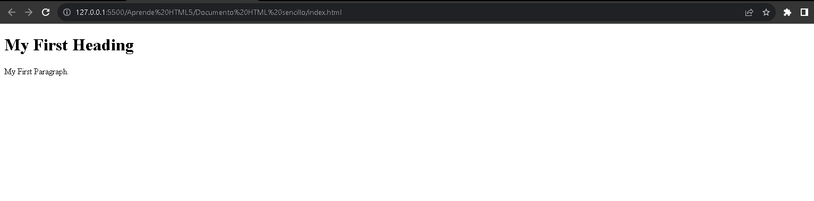

# Documento HTML sencillo 
~~~
<!DOCTYPE html>
    <html lang="es">

        <head>
            <meta charset="UTF-8">
            <meta name="viewport" content="width=device-width, initial-scale=1.0">
        
            <title>Page Title</title>
        </head>

        <body>
                <h1>My First Heading</h1>
                
My First Paragraph.

        </body>
    </html>
~~~
## Explicación de la estrutura
-   La  declaración `<!DOCTYPE html>` define que este documento, es un documento de tipo __HTML__.
-   El elemento `<html>` es el elemento raíz de una página __HTML__.
-   El elemento `<head>` es el elemento que contiene la metainformación de la página __HTML__.
-   El elemento `<tilte>` es el elemento encargado de especificar un título para la página __HTML__(que se muestra en la barra del título del navegador o en la pestaña de la página).
-   El elemento `<body>` es el elemento que define el cuerpo del documento y es un contenedor de todos los datos visibles, como encabezados, párrafos, imagenes, hipervinculos, tablas, listas, etc.
-   El elemento `<h1>` es el elemento que define un encabezado principal en la página __HTML__.
-   El elemento `
` es le elemento que defien un párrafo en la página __HTML__.

## Ejecución del proceso
La declaración `<!DOCTYPE html>` nos permite programar una estructura en un lenguaje de programación. la declaración nos esta indicando tanto a nosotros como al navegador que la estructura que estara por debajo de la declaración `<!DOCTYPE html>` será una estructura escrita en el lenguaje de marcado __HTML__.

El elemento `<html>` nos inica que solo podrá contener información escrita en __HTML__ cabe aclarar que en algunos casos podemos encontrar código en __CSS__ o en __PHP__ , este elemento también le indicará al navegador de que origen esta elaborada la página.

El elemento `<head>` nos permite contener la metainformación. La __metainformación__ son simplemente pequeños segmentos de información. La función principal de la __metainformación__   es proporcionar algunos detalles generales sobre el contenido de la página __HTML__.

-   La declaración `<meta>` con el atributo `charshet='UTF-8'` nos permite ingreser caracteres especiales del Español latino, como lo puede se la letra __Ñ/ñ__

~~~
<meta charset="UTF-8">
~~~

-   La declaración `<meta>` con el atributo `name='viewport'` es la encargada de que el sitio web se vea y funcione de manera óptima en los dispositivos móviles miestras que el atirbuto `content='width=device-width, initial-scale=1.0 '` sirve para configurar el ancho del dispositivo `width=device-width`, y el nivel de zoom cuando la página se carga por primera vez `initial-scale=1.0`.

-   El elemento `<tilte>` es capaz de mostrarle al usuario el título de la página web en la pestaña de navegación del navegador que esté usando, si esta etiqueta no llega a presentar un contenido de texto entre la etiqueta de apertura y la etiqueta de cierre, por defecto nos mostrará el servidor local y  el nombre del archivo o ruta de alojamiento en donde se encuentra el documento.

-   El elemento `<body>`  es el que contendra el cuerpo del documento __HTML__ todas las etiqutas que se encuentren en su interior serán visibles para el usuario y se verán reflejadas en el navegador.

-   El elemento `<h1>` es el elemento que se encargará de mostrar un título princiapal en la página web, si se require el uso de otros tamaños se usará la escala de titulos declarada en __HTML__(h1,h2,h3,h4,h5,h6).

- El elemnto `
` se encargara de contener todos los párrafos que se encuentre en la página web, cabe aclarar que se debe de usar una etiqueta de apertura `
` y  una etiqueta de cierre `
` por cada uno de los párrafos que se lleguen a usar

## Ejecución en un navegador (Google Chrome)

